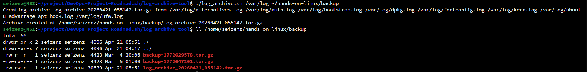

# Log Archive Tool
Build a tool to archive logs from the CLI with the date and time.

## Project URL
https://roadmap.sh/projects/log-archive-tool

## Project Details
This project build a tool to archive logs on a set schedule by compressing them and storing them in a new directory, this is especially useful for removing old logs and keeping the system clean while maintaining the logs in a compressed format for future reference. The most common location for logs on a unix based system is /var/log.

## Requirements
The tool should run from the command line, accept the log directory as an argument, compress the logs, and store them in a new directory. The user should be able to:

- Provide the log directory as an argument when running the tool.

    `log-archive <log-directory>`

- The tool should compress the logs in a tar.gz file and store them in a new directory.

- The tool should log the date and time of the archive to a file.

    `logs_archive_20240816_100648.tar.gz`

## Screenshot

