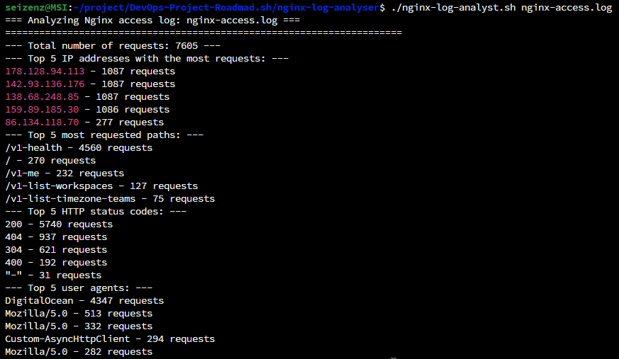

# Nginx Log Analyser
Write a simple tool to analyze logs from the command line.

## Project URL
https://roadmap.sh/projects/nginx-log-analyser

## Project Details
The goal of this project is to write a simple tool to analyze logs from the command line.

## Requirements
Download the sample nginx access log file from [here](https://gist.githubusercontent.com/kamranahmedse/e66c3b9ea89a1a030d3b739eeeef22d0/raw/77fb3ac837a73c4f0206e78a236d885590b7ae35/nginx-access.log). The log file contains the following fields:
```
IP address

Date and time

Request method and path

Response status code

Response size

Referrer

User agent
```
Create a shell script that reads the log file and provides the following information:

- Top 5 IP addresses with the most requests

- Top 5 most requested paths

- Top 5 response status codes

- Top 5 user agents

## Screenshot

