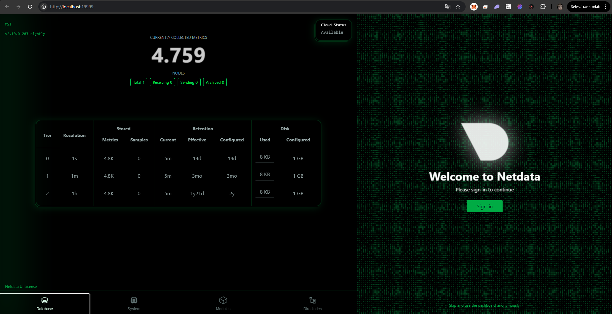
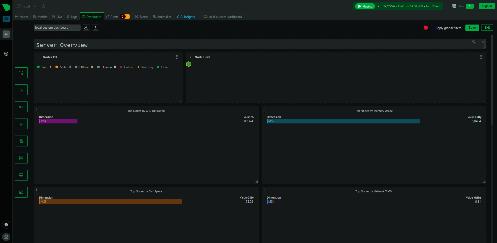
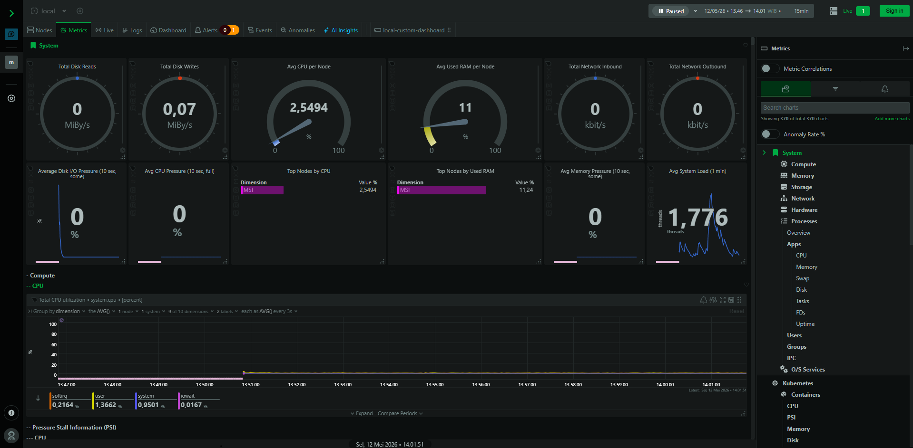
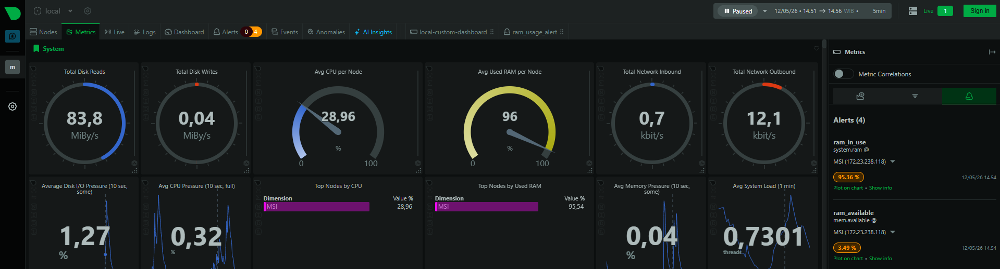
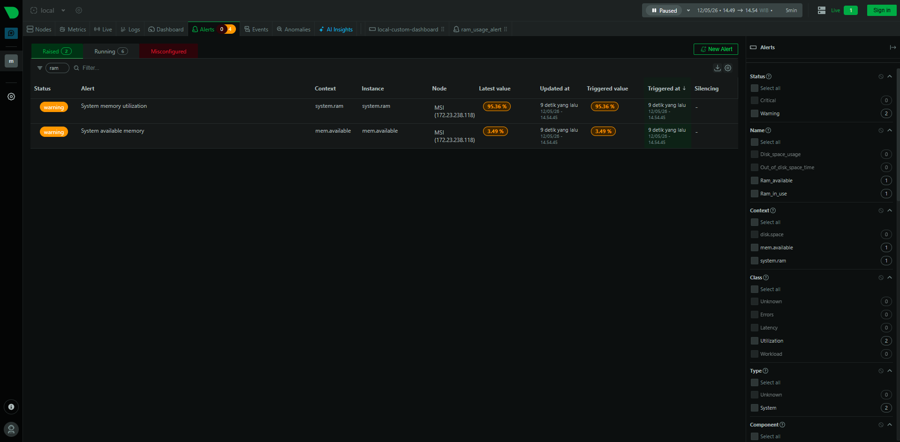

# Simple Monitoring Dashboard
Set up a basic monitoring dashboard using Netdata.

## Project URL
https://roadmap.sh/projects/simple-monitoring-dashboard

## Project Details
The goal of this project is to learn the basics of monitoring. It is help to understand how to monitor the health of a system and how to set up a basic monitoring dashboard.

## Requirements
In this project, you will set up a basic monitoring dashboard using Netdata. Netdata is a powerful, real-time performance and health monitoring tool for systems and applications.

- Install Netdata on a Linux system.

- Configure Netdata to monitor basic system metrics such as CPU, memory usage, and disk I/O.

- Access the Netdata dashboard through a web browser.

- Customize at least one aspect of the dashboard (e.g., add a new chart or modify an existing one).

- Set up an alert for a specific metric (e.g., CPU usage above 80%).

create a few shell scripts to automate the setup and test the monitoring dashboard.

- setup.sh: A shell script to install Netdata on a new system.

- test_dashboard.sh: Script to put some load on the system and test the monitoring dashboard.

- cleanup.sh: Script to clean up the system and remove the Netdata agent.

The goal with this automation is to slowly get accustomed to DevOps practices and CI/CD pipeline

## Getting Started
1. Prerequisites
Make sure your system supports systemd (especially if you are using WSL) and has internet access to download packages.

2. Installation
Run the setup script to build the entire monitoring infrastructure:

```
chmod +x setup.sh test_dashboard.sh cleanup.sh
sudo ./setup.sh
```

3. Accessing the Dashboard
Open your browser and access the following address:

    `http://localhost:19999`

## Testing & Verification
To verify whether the dashboard and alerts are working, run the load testing script:


`./test_dashboard.sh`

Select the Stress option. Then observe the Netdata Dashboard. The graph will spike in real-time. The Alarms indicator will change status when usage exceeds the 80% threshold.

```
In this case I am using the RAM stress option
```

## Cleanup
Gunakan skrip pembersih untuk mengembalikan sistem ke kondisi semula. Ini penting dalam praktik DevOps untuk menjaga kebersihan lingkungan pengembangan.

`sudo ./cleanup.sh`

## Screenshot
- Welcome Dashboard


- Dashboard Server Overview


- Metrics Dashboard


- Metrics Alert View


- Alert View

