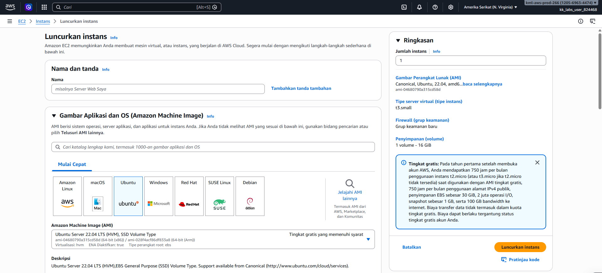
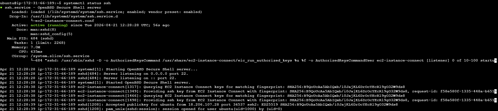
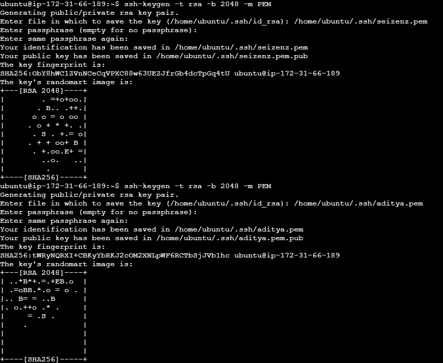
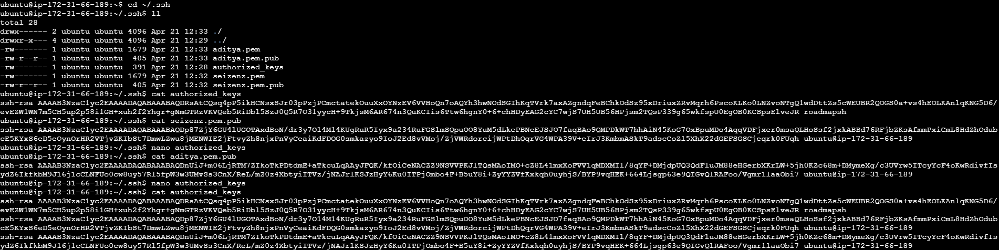
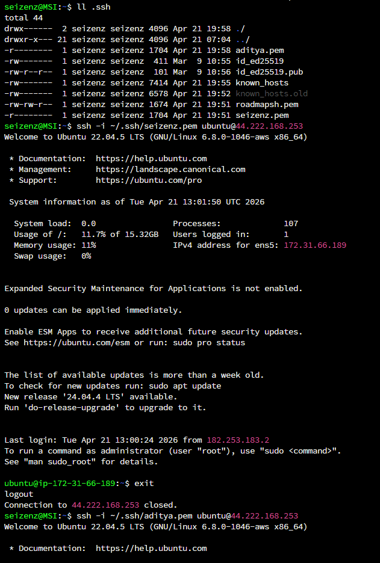
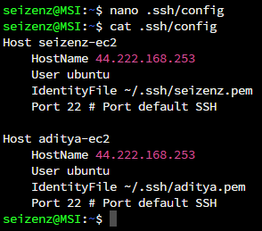

# SSH Remote Server Setup
Setup a basic remote linux server and configure it to allow SSH.

## Project Details
Complete setup a basic remote linux server and configure it to allow SSH.

## Requirements
- Setup a remote linux server and configure it to allow SSH connections.

- Register and setup a remote linux server on any provider e.g. a simple droplet on DigitalOcean which gives you $200 in free credits with the link. Alternatively, use AWS or any other provider.

- Create two new SSH key pairs and add them to the server.

- You should be able to connect to your server using both SSH keys.

- You should be able to use the following command to connect to your server using both SSH keys.

`ssh -i <path-to-private-key> user@server-ip`

Also, look into setting up the configuration in ~/.ssh/config to allow you to connect to your server using the following command.

`ssh <alias>`

The only outcome of this project is that you should be able to SSH into your server using both SSH keys. Future projects will cover other aspects of server setup and configuration.

Stretch goal: install and configure fail2ban to prevent brute force attacks.

## Steps
- Buat instance vm AWS EC2
- Hubungkan ke terminal instance vm
- Di dalam terminal vm masukkan perintah `systemctl status ssh` untuk cek apakah layanan ssh sudah berjalan/belum
- Jika sudah, lakukan generate ssh key dengan perintah `ssh-keygen -t rsa -b 2048 -m PEM` ini akan menghasil 2 file, yaitu ssh private key dan public key
- Jika sudah tergenerate, masuk ke dir hasil generate key tadi tersimpan `cd ~/.ssh && ll`
- Lihat isi file .pub (Ini adalah file public key), lalu copy dan masukkan ke file authorized_keys. Ini untuk akses login permission melalui ssh key ke server
- Lihat isi file .pem (Ini adalah file private key), lalu copy dan simpan di lokal pc untuk digunakan mengakses server melalui ssh
- Test connection ssh :
    - Buka terminal lokal, jalankan perintah `ssh -i <path-to-private-key> user@server-ip`
- Tambahkan alias untuk koneksi ssh ke server :
    - Buat file config di ~/.ssh, dengan perintah `nano ~/.ssh/config`. 
    - Buat entri berikut
    ```
    Host <nama-alias>
        HostName <ip-host>
        User <nama-user>
        IdentityFile <path-to-private-key>
        Port 22 # Port default SSH
    ``` 

## Screenshot

- AWS-EC2-instance



- SSH service running



- SSH key generated



- SSH public key



- SSH connection 



- SSH config

