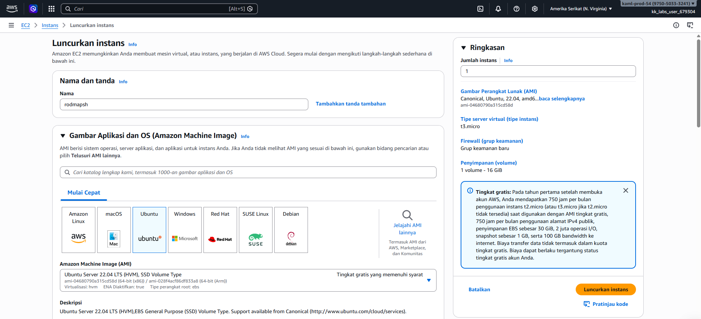
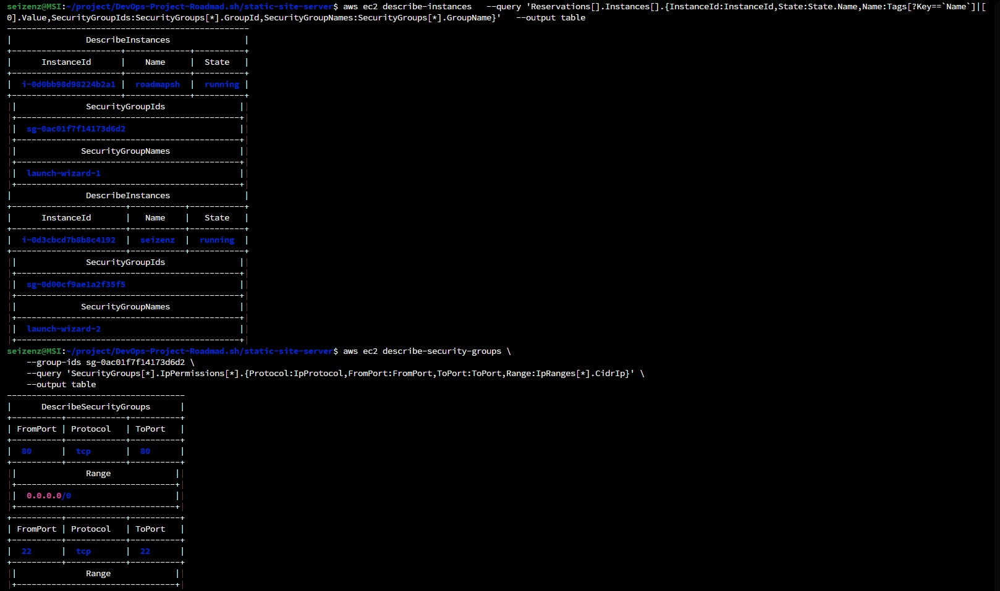
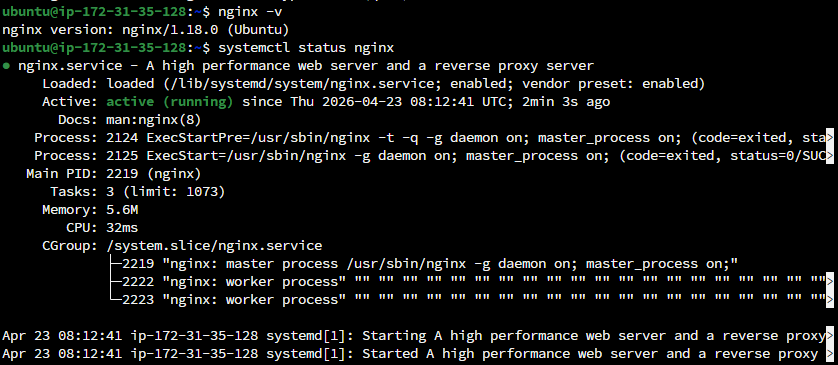
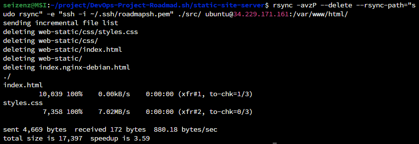
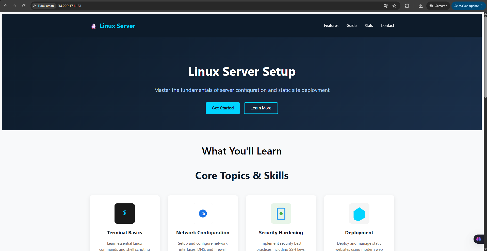

# Static Site Server
Setup a basic linux server and configure it to serve a static site.

## Project URL
https://roadmap.sh/projects/static-site-server

## Project Details
The goal of this project is to help to understand the basics of setting up a web server using a basic static site served using Nginx. And also learn how to use rsync to deploy your changes to the server.

## Requirements
- Cloud Provider **(In this project using AWS Playground from Kodekloud)**
- Make sure that you can connect to your server using SSH.
- Install and configure nginx to serve a static site.
- A simple webpage with basic HTML, CSS and image files.
- Use rsync to update a remote server with a local static site.
- If you have a domain name, point it to your server and serve your static site from there. Alternatively, set up your nginx server to serve the static site from the server's IP address. **(In this project using Alternative server's IP address)**

## Steps
- Buat instance AWS EC2
- Buat access key baru untuk keperluan access AWS CLI (Simpan Access Key ID dan Secret Key)
- Install dan konfigurasi AWS CLI di terminal ubuntu lokal menggunakan perintah berikut
```
# Unduh paket instalasi:
curl "https://awscli.amazonaws.com/awscli-exe-linux-x86_64.zip" -o "awscliv2.zip"

# Ekstrak paket tersebut:
unzip awscliv2.zip

# Jalankan installer:
sudo ./aws/install

# Verifikasi instalasi:
aws --version

# Konfigurasi Kredensial
aws configure

    Isi data yang diminta:
    •AWS Access Key ID: Masukkan Access Key
    •AWS Secret Access Key: Masukkan Secret Key 
    •Default region name: us-east-1 
    (sesuai server yang digunakan)
    •Default output format: json
```
- Cek informasi instance dan security group yang terpasang menggunakan perintah berikut
```
aws ec2 describe-instances   --query 'Reservations[].Instances[].{InstanceId:InstanceId,State:State.Name,Name:Tags[?Key==`Name`]|[0].Value,SecurityGroupIds:SecurityGroups[*].GroupId,SecurityGroupNames:SecurityGroups[*].GroupName}'   --output table
```
- Tambahkan izin akses HTTP dari mana saja dan izinkan akses port 80/tcp menggunakan perintah berikut
```
aws ec2 authorize-security-group-ingress \
    --group-id <sesuaikan dengan sg-id-instance> \
    --protocol tcp \
    --port 80 \
    --cidr 0.0.0.0/0
```
- Verifikasi rule yang sudah terpasang menggunakan perintah
```
aws ec2 describe-security-groups \
    --group-ids <sesuaikan dengan sg-id-instance> \
    --query 'SecurityGroups[*].IpPermissions[*].{Protocol:IpProtocol,FromPort:FromPort,ToPort:ToPort,Range:IpRanges[*].CidrIp}' \
    --output table
```

- Masuk ke instance menggunakan ssh 

`ssh -i <path-file.pem> user@ip-server`

- Di dalam terminal server install nginx

`sudo apt update`

`sudo apt-get install -y nginx`

- Verifikasi service nginx

`nginx -v`

`systemctl start nginx`

- Buat file html dan css di lokal
    - [index.html](./src/index.html)
    - [styles.css](./src/styles.css)

- Deploy ke AWS EC2 dengan menggunakan rsync

`rsync -avzP --delete --rsync-path="sudo rsync" -e "ssh -i <path-ssh-key>" ./src/ ubuntu@<ip-server>:/var/www/html/`

```
Catatan: Metode ini memerlukan user ubuntu untuk bisa menjalankan sudo tanpa password (yang merupakan standar default pada instance EC2 Ubuntu).
```

## Screenshot
- AWS EC2 Instance


- Security Group


- Nginx


- Deploy with rsync


- Static Site Server
